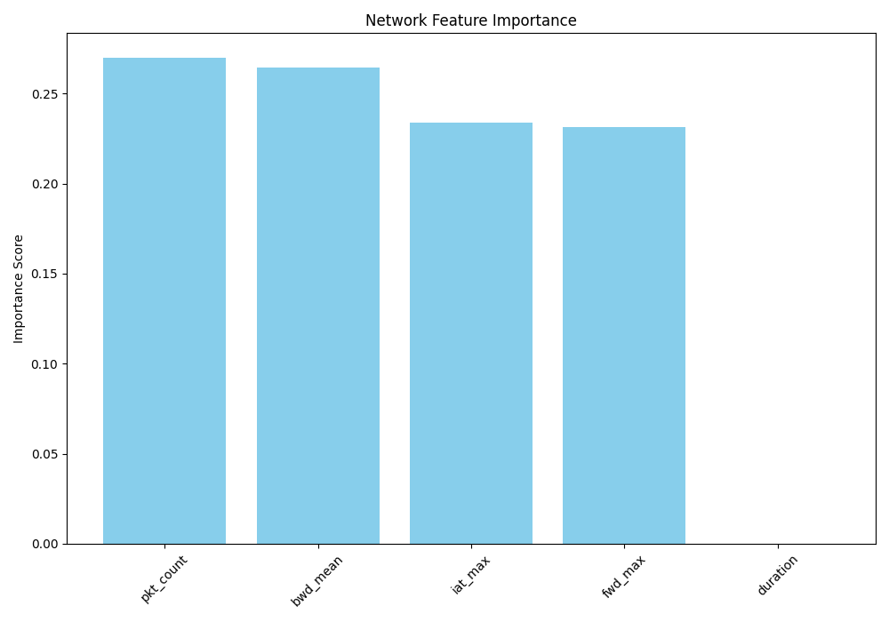
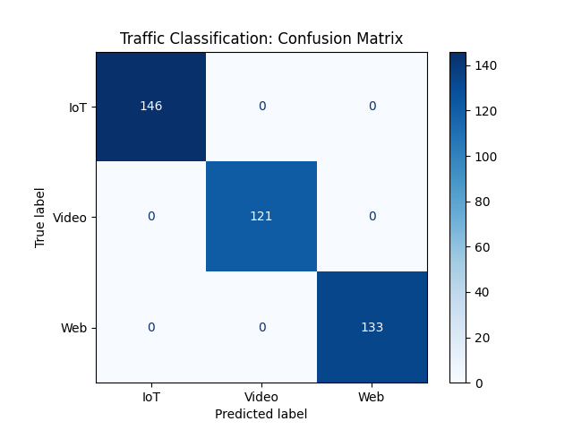

# 🧠 Concept Explainer: AI-Driven Traffic Classification

### 📌 Project Overview

Traditional network management relies on **Deep Packet Inspection (DPI)** or static port-based rules to identify applications. However, with the rise of **HTTPS/TLS encryption** and dynamic port allocation, these methods are becoming obsolete. This project demonstrates how we can use **Flow Metadata** and **Machine Learning** to classify traffic based on its behavioral "fingerprint" rather than its content.

### 🏗️ The Machine Learning Pipeline

#### 1. Feature Engineering (The Input)

Instead of looking at the data payload, we extract five statistical features from the network flow:

- **`fwd_max`**: Maximum packet size. Video streams typically saturate the MTU at 1500 bytes.
- **`iat_max`**: Maximum Inter-Arrival Time. Represents the "rhythm" of the app (IoT is bursty; Video is constant).
- **`bwd_mean`**: Average size of returning packets, critical for identifying Web response patterns.

### 📊 Model Interpretability

To ensure the model is making decisions based on valid network logic, we analyze two key metrics:

#### **1. Feature Importance**

_Network traffic is non-linear. The bar chart above shows that **iat_max** (Inter-Arrival Time) and **fwd_max** (Packet Size) are the strongest indicators of traffic type. This confirms our hypothesis that IoT and Video streams have distinct "rhythms"._

#### **2. Confusion Matrix**

_By evaluating the model against the 20% "unseen" test set, we can see exactly where misclassifications occur. A diagonal blue line indicates that our model successfully distinguished between IoT, Web, and Video flows with high precision._

---

### 🛡️ Real-World Impact

- **Quality of Service (QoS)**: Automatically prioritizing "Video" over "IoT" updates to prevent buffering.
- **Security**: Detecting **Data Exfiltration** if an IoT device suddenly exhibits the high-throughput behavior of a Video stream.

### 🎓 Lessons Learned

- **Generalization**: By splitting our 2,000-row dataset (80/20), we ensure the model generalizes to new traffic.
- **Preprocessing**: Handling `Inf` and `NaN` values is mandatory for network data to avoid model crashes.
- **Scaling**: Normalizing features ensures the model treats "Duration (ms)" and "Packet Size (bytes)" with equal mathematical importance.
